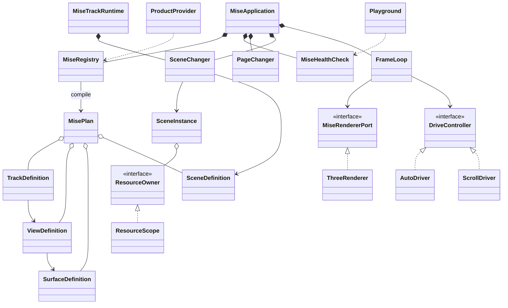

# MISE WebGL Core Architecture

## 0. 문서 지위

**`mise-webgl`은 Three.js/WebGL 기반의 장면·스크롤·자동 진행·DOM 상호작용을
조합하는 MISE Web Foundation의 TypeScript core package다.**

| 항목 | 값 |
|---|---|
| 문서 상태 | canonical architecture |
| 문서 소유권 | MISE 구조, 공개 API, 생명주기, 타입, 자원, Shader, 검증과 NPM 배포 규칙 |
| package identity | `mise-webgl` |
| 문서 entry | [`README.md`](./README.md) |
| 완료 판정 | [`VERIFICATION.md`](./VERIFICATION.md) |

이 파일은 `mise-webgl` core의 **전체 canonical specification**이다. 상위 Web
Foundation과 PHP MVC·HTML Component·SCSS·Prompt 계약은
[`WEB-FOUNDATION.md`](./WEB-FOUNDATION.md)와 각 전문 문서가 소유한다. 문서
entry와 이동 가능한 파일 목록은 [`README.md`](./README.md)가 소유한다.

> **독립성 경계:** 이 package 문서는 Host 저장소의 경로, 제품명, release별 평가 수치와 실행 결과를 포함하지 않는다. 구현 상태와 제품별 증거는 Host가 별도로 소유한다.

규칙 단어:

- **MUST**: 위반 시 MISE 부적합이다.
- **MUST NOT**: 구현과 리뷰에서 금지한다.
- **SHOULD**: 예외 근거와 검증 결과가 있을 때만 벗어날 수 있다.
- **MAY**: 제품 요구가 있을 때 선택할 수 있다.

외부 문서가 설명하는 사실과 MISE가 선택한 설계 결정을 구분한다.

- **공식 근거**: TypeScript, Node.js, npm, Vite, Three.js, Laravel, GSAP, Lenis, Barba 등의 공식 문서가 소유하는 사실이다.
- **MISE 결정**: 공식 근거와 현재 도메인을 바탕으로 이 프로젝트가 선택한 규칙이다.
- **비규범 사례**: Agency 사례에서 공개된 결과와 제작 방식이다. 비공개 framework 내부를 추정하지 않는다.

---

## 1. 규칙 ID

| Prefix | 영역 |
|---|---|
| `ARC` | 아키텍처와 의존 방향 |
| `API` | 공개 API와 package surface |
| `TYP` | TypeScript 타입 |
| `IOC` | Provider, Registrar, Plan, boot |
| `LIF` | Page·Scene·Cue 생명주기 |
| `DRV` | Scroll·Auto·custom Driver |
| `FRM` | RAF·시간·delta·render demand |
| `REN` | Renderer·Viewport·Quality |
| `RES` | 자원 ownership·Asset |
| `SHD` | Shader·uniform·Effect |
| `DOM` | DOM·Motion·Navigation |
| `HLT` | Health Check |
| `DBG` | Playground·Inspector·Logging |
| `NPM` | NPM package와 호환성 |
| `TST` | 검증·테스트·release gate |

규칙을 변경하면 같은 변경에서 구현, 테스트, 이 문서와 영향받는 전문 문서를 갱신한다.

---

## 2. MISE가 해결하는 문제

MISE의 사용자 경험은 다음 문장으로 끝나야 한다.

```text
Provider로 Experience와 platform adapter를 등록한다.
Experience에 순서가 있는 Scene을 선언한다.
Scene마다 Scroll, Auto 또는 명시적으로 등록한 Driver를 선택한다.
Scene 안에서 Three.js object, DOM cue와 Shader owner를 조합한다.
MISE가 frame, 전환, 취소, renderer, 자원, viewport와 진단을 처리한다.
```

제품 개발자가 직접 처리하지 않는 것:

- renderer singleton 조립
- Scene별 `requestAnimationFrame`
- Lenis·GSAP ticker 중복 연결
- Barba lifecycle과 Scene lifecycle 혼합
- 오래된 async Scene의 commit
- geometry·material·texture의 암묵적 disposal
- 전역 Service Locator를 통한 runtime 접근
- Shader uniform의 외부 직접 변경
- 제품마다 달라지는 debug wiring

### 사용 대상

MISE는 다음 형태의 경험을 목표로 한다.

- 스크롤에 따라 카메라가 경로를 이동하는 WebGL 포트폴리오
- 자동 재생되는 cinematic Scene sequence
- Scene 사이에 SSR/DOM 텍스트와 인터랙션이 나타나는 페이지
- Three.js object와 custom Shader가 함께 움직이는 경험
- GLB/Blender asset을 지연 로드하고 Scene 수명에 맞춰 정리하는 경험
- reduced-motion, coarse pointer, iOS Safari와 Samsung Internet fallback이 필요한 경험

### 비목표

- React/Vue component framework
- 일반 게임 엔진
- ECS 전체 구현
- 범용 DI container
- CMS·routing·SSR framework
- 모든 renderer와 모든 animation library를 추상화하는 universal engine
- 실제 consumer 없이 미리 만드는 Shader DSL, Asset pipeline 또는 physics layer

---

## 3. 최종 공식 패턴

### 3.1 공식 분류

MISE의 구조적 분류는 다음과 같다.

```text
Browser Three.js/WebGL Scene Experience Domain Framework
+
Hexagonal Architecture
+ Inversion of Control
+ Scene-Oriented domain model
+ MISE Stagecraft lifecycle
```

- MISE는 브라우저 Three.js/WebGL Scene Experience에 한정된 **도메인 특화
  애플리케이션 프레임워크**다.
- 실행 순서, 생명주기, 프레임, 렌더링 경계와 자원 정리를 MISE가 호출하므로
  단순 utility library가 아니다.
- `mise-webgl` core에 범용 UI·DOM component framework와 game engine 책임을
  넣는 것은 비목표다. 인접 `mise-ui`·`mise-php` package 경계는
  [`WEB-FOUNDATION.md`](./WEB-FOUNDATION.md)가 소유한다.
- **Hexagonal Architecture**는 Kernel과 vendor 구현 사이의 의존 방향을 정한다.
- **IoC**는 실행 순서와 생명주기를 MISE가 소유하게 한다.
- **Scene-Oriented domain model**은 Experience와 Scene을 서사의 기본 단위로 사용한다.
- **Stagecraft**는 MISE가 정의한 Provider, Plan, Stage, Cue, Changer, Driver, Scope, Port 규칙이다.

`Scene-Oriented`는 MISE 도메인을 설명하는 용어다. 독립적으로 검증된 범용 표준 아키텍처라고 주장하지 않는다.

### 3.2 MVC를 사용하지 않는 이유

MVC는 데이터·입력·표현 분리에 유용하지만 다음 MISE 핵심 책임을 충분히 표현하지 못한다.

- 시간과 스크롤에 따른 Scene 진행
- GPU resource 수명
- 비동기 Scene 준비와 취소
- active Scene 원자적 교체
- 단일 renderer와 RAF
- Shader compile과 uniform ownership
- DOM page와 WebGL Scene의 서로 다른 lifecycle

MISE는 MVC를 부정하지 않는다. WebGL core의 최상위 패턴으로 사용하지 않을
뿐이다. PHP SSR request·Model·View·Controller 경계는
[`WEB-FOUNDATION §3`](./WEB-FOUNDATION.md#3-mvc-적용-경계)을 따른다.

### 3.3 Stagecraft

```text
Provider
→ Registrar
→ Plan Compiler
→ Immutable MisePlan
→ Restricted Container
→ Application Factory
→ Stage
→ Cue Pipeline
→ Changer
→ Driver
→ Scope
→ Port
```

| 요소 | 단일 책임 |
|---|---|
| Provider | definition과 adapter factory 등록 |
| Registrar | 허용된 typed slot에 등록만 수행 |
| Plan Compiler | 중복·누락·참조·capability 검증 |
| MisePlan | 실행 전에 고정된 immutable graph |
| Restricted Container | Composition Root의 typed binding과 lifetime cache |
| Application Factory | Container 결과를 explicit constructor graph로 조립 |
| Stage | browser와 WebGL orchestration |
| Cue Pipeline | `before → action → after` 순서 |
| Changer | 전환 취소·commit·rollback·dispose |
| Driver | 입력을 `DriveSample`로 정규화 |
| Scope | own·borrow·lease와 역순 정리 |
| Port | Kernel과 외부 구현의 작은 계약 |

### 3.4 패턴 사용 경계

| 패턴 | 사용 위치 | 남용 방지 |
|---|---|---|
| Facade | `createMise`, application public handle | Kernel class 재노출 금지 |
| Builder/Compiler | registration → `MisePlan` | runtime resolve 금지 |
| Strategy | Driver, Renderer, Motion, Navigation | object마다 Strategy 생성 금지 |
| State Machine | SceneChanger, PageChanger | boolean flag 조합으로 상태 표현 금지 |
| Pipeline | Cue와 frame phase | 전역 event bus로 순서 대체 금지 |
| Composite ownership | ResourceScope child | scene graph 전체 무조건 dispose 금지 |
| Null Object | production Debug port | 실제 오류 은폐 금지 |
| Restricted DI | application/container/factory | Scene·Object의 runtime resolve 금지 |
| Abstract Factory | application/runtime/product Object 생성 | update·render·dispose 책임 흡수 금지 |

**ARC-01** MISE MUST use Hexagonal + IoC as the structural rule.  
**ARC-02** Stagecraft MUST own lifecycle; 제품 코드가 실행 흐름을 탈취하면 안 된다.  
**ARC-03** 패턴 이름을 늘리기 위해 구현 하나짜리 추상 계층을 만들면 안 된다.  
**ARC-04** 상태·identity·resource lifecycle이 없는 계산은 class보다 순수 함수를 우선한다.

### 3.5 Container, Factory와 Object Host

MISE Container는 범용 DI framework가 아니다. Provider registration과 Plan compile 뒤
Composition Root에서만 사용되는 제한형 graph builder다.

```text
Registry compile
→ ContainerBuilder bind
→ sealed Container
→ ApplicationFactory resolve
→ explicit Runtime constructor/context
```

- generic token identity를 사용한다.
- value, singleton, scoped, transient lifetime을 구분한다.
- duplicate, missing, cycle과 sealed mutation을 즉시 실패시킨다.
- Scene, Driver와 Object에 Container를 전달하지 않는다.
- Container cache와 ResourceScope ownership을 동일시하지 않는다.
- 제품 Object는 `defineObjectFactory`와 Scene-local Object Host로 생성한다.

세부 계약은 [`ENTERPRISE-COMPOSITION.md`](./ENTERPRISE-COMPOSITION.md)가 설명한다.

---

## 4. 도메인 언어

| 용어 | 정의 | 소유하지 않는 것 |
|---|---|---|
| Application | MISE 공개 실행 handle | 제품 Scene 세부 구현 |
| Provider | definition과 adapter 등록 단위 | runtime Service Locator |
| Experience | 순서가 있는 하나의 서사 | URL·router |
| Stage | 한 Experience의 동시 Surface·View·Track 실행 graph | 전역 singleton |
| Surface | 물리 canvas·Renderer·WebGL context 경계 | 제품 Scene 의미 |
| View | Surface 내부 viewport·scissor render 영역 | Scene lifecycle |
| Track | 한 View에 연결된 독립 Scene 순서·Changer·Driver 수명 | 다른 Track |
| Page | SSR DOM lifecycle 단위 | WebGL renderer |
| Scene | 독립 prepare·activate·dispose가 필요한 WebGL 단위 | 다른 Scene |
| Segment | 같은 Scene resource 수명 안의 `before/main/after` 구간 | 독립 preload·dispose |
| Cue | 순서가 보장되는 lifecycle 작업 | frame hot path |
| Driver | 입력을 progress·velocity·direction으로 변환 | 카메라·Shader |
| Scene Instance | Scene·Camera와 frame/resize/dispose 구현 | global singleton |
| Effect | Shader/material/uniform의 owner | Scene transition |
| Port | 외부 구현을 대체하는 최소 계약 | vendor-specific API |
| Scope | 한 lifecycle boundary의 resource owner | 공유 asset의 무조건 dispose |
| Lease | 공유 자원 사용권 | 자원 본체의 영구 소유 |
| Plan | 등록 검증 후 고정된 실행 graph | runtime mutation |
| Health Profile | 설치된 capability에서 파생된 협력 기대값 | FPS·visual correctness |

### Page, Experience, Scene 선택 기준

```text
URL/SSR DOM 수명이 바뀐다
→ Page

하나의 서사 안에 순서가 있는 장면 묶음이다
→ Experience

동시에 진행되는 배경·section Scene 순서가 둘 이상이다
→ Experience Stage의 Track

같은 canvas에서 section별 render 영역만 다르다
→ compositor Surface의 View

별도 canvas·해상도·stacking·context 장애 격리가 필요하다
→ isolated Surface

별도 prepare, abort, fallback, dispose가 필요하다
→ Scene

같은 geometry/material/asset을 유지하며 값만 변한다
→ Segment

uniform·material·shader program 수명이다
→ Effect owner
```

**ARC-05** Experience MUST own Scene order through an explicit readonly array.  
**ARC-06** Scene MUST NOT contain or activate another Scene.  
**ARC-07** URL과 filesystem routing 정보는 Page/Scene definition에 들어가지 않는다.  
**ARC-08** 독립 resource lifecycle이 없는 시각 구간을 Scene으로 과분할하지 않는다.
**ARC-17** Application은 RAF·Scroll·Plan을 하나만 소유하고 Surface마다 Renderer·canvas를 하나씩 소유한다.
**ARC-18** 한 View에는 한 Track만 연결하며 Track끼리 Scene·Driver·Changer를 직접 참조하지 않는다.
**ARC-19** 기존 `Experience.scenes` form은 default Surface·View·Track으로 정규화한다.
**ARC-20** section effect는 compositor View를 기본으로 하고 물리 격리가 필요한 경우에만 isolated Surface를 사용한다.

---

## 5. 의존 방향과 관계

### 5.1 허용 방향

```text
Host Composition Root
  ├─ imports MISE public API
  ├─ imports MISE adapter subpaths
  └─ imports Host Providers

Host Experience
  → MISE public contracts

MISE Application
  → Immutable Plan
  → Kernel
  → Ports

Infrastructure Adapter
  → MISE public ports

MISE Kernel
  ✕ Host Experience
  ✕ Host Infrastructure
  ✕ vendor singleton
```

### 5.2 UML



### 5.3 자동 enforcement

정적 의존성 Gate가 검사할 항목:

- circular dependency 0
- Kernel → Experience 0
- Kernel → product infrastructure 0
- Experience → Kernel deep import 0
- Adapter → Kernel deep import 0
- Experience ↔ Adapter 직접 import 0
- production → test import 0
- package export 밖 deep import 0

**ARC-09** Host Experience는 package public entry만 import한다. Package 내부 Adapter는 root facade를 역참조하지 않고 Contracts·logging Port에만 의존한다.  
**ARC-10** Composition Root만 Experience, Adapter와 MISE 생성 factory를 동시에 알 수 있다.  
**ARC-11** Kernel은 ConsoleLogSink 같은 concrete infrastructure를 import하면 안 된다.  
**ARC-12** type-only cycle도 공개 계약 누수의 신호로 취급하고 제거해야 한다.

---

## 6. NPM package 구조

첫 공개 버전은 여러 package로 분산하지 않고 **단일 package + 명시적 subpath exports**를 사용한다.

| 경로 | 소유권 |
|---|---|
| `package.json`, `*.config.*`, `tsconfig*` | package identity, export, build·test 설정 |
| `src/*.ts` | 공개 facade와 명시적 subpath entry |
| `src/types/` | 공개 계약 type |
| `src/definitions/` | definition helper와 immutable snapshot |
| `src/application/`, `src/factory/` | composition root와 생성 정책 |
| `src/container/`, `src/clock/` | 제한형 Container와 시간 정규화 |
| `src/kernel/` | 비공개 lifecycle·Plan·Runtime 구현 |
| `src/objects/` | Object Host와 Stage 조립 |
| `src/adapters/<vendor>/` | concrete vendor Adapter |
| `src/dom/`, `src/logging/` | Surface DOM과 안전한 lifecycle logging |
| `src/playground/`, `src/testing/` | optional debug와 consumer test 지원 |
| `html/`, `styles/` | versioned Surface·Inspector contract |
| `docs/` | 이동 가능한 package 공식 문서 |
| `scripts/`, `etc/`, `tests/` | Gate, API report, framework test |

구체 파일명은 source와 export map이 소유한다. 이 문서는 디렉터리 책임과 의존
경계만 고정해 구현 목록의 수동 복제를 피한다.

파일 분리 기준:

- 변경 이유가 다르면 분리한다.
- lifecycle owner가 다르면 분리한다.
- public contract와 concrete implementation은 분리한다.
- vendor import가 생기면 adapter boundary로 분리한다.
- 단순 줄 수를 줄이기 위해 unrelated responsibility를 합치지 않는다.
- 빈 interface, 미래용 Manager, Service, Utils 폴더를 만들지 않는다.

**ARC-13** package 내부 `kernel/`은 export map에 포함하지 않는다.  
**ARC-14** Adapter는 각 vendor별 생성·실패·dispose 경계 때문에 분리한다.  
**ARC-15** 제품 Experience는 package 밖에 남는다.  
**ARC-16** MISE Surface의 HTML contract, native DOM owner와 SCSS는 package 안에서 함께 versioning한다.
**ARC-21** Container import와 resolve는 application·container·factory layer에만 허용한다.
**ARC-22** `Contracts.ts`는 type·definition re-export facade로 유지한다.
**ARC-23** production TS는 450줄 budget을 넘으면 Architecture Gate를 실패시킨다.

---

## 7. 공개 package surface

Package identity는 `mise-webgl`이다. 실제 publish 전 registry 이름 소유권과 license를 확인한다. license가 승인되기 전 repository manifest는 `private: true`, `UNLICENSED`, `publishConfig` 부재 상태를 유지해 accidental publish를 차단한다.

```text
mise-webgl
mise-webgl/clock
mise-webgl/container
mise-webgl/blender
mise-webgl/three
mise-webgl/gsap
mise-webgl/lenis
mise-webgl/barba
mise-webgl/console
mise-webgl/playground
mise-webgl/testing
mise-webgl/styles.css
mise-webgl/styles.scss
mise-webgl/playground.css
mise-webgl/playground.scss
mise-webgl/surface.html
```

### 7.1 root API

```ts
createMise()
createMiseLogger()
resolveBrowserLogLevel()
MiseError
MiseAggregateError
defineProvider()
defineExperience()
defineSurface()
defineView()
defineTrack()
definePage()
defineScene()
defineDriver()
scroll()
auto()
```

Root runtime value는 위 작성·생성·logging API로 제한한다. Port와 definition type은 type-only export한다.

### 7.2 export 금지

- `FrameLoop`
- `SceneChanger`
- `PageChanger`
- `MiseRegistry`·`MisePlan`
- `ResourceScope`
- concrete Registry
- Health collector 구현
- renderer singleton
- raw Shader uniform map
- internal error detail

### 7.3 export map 원칙

```json
{
  "type": "module",
  "files": ["dist", "docs", "html", "styles", "README.md"],
  "exports": {
    ".": {
      "types": "./dist/Index.d.ts",
      "import": "./dist/Index.js"
    },
    "./three": {
      "types": "./dist/Three.d.ts",
      "import": "./dist/Three.js"
    },
    "./blender": {
      "types": "./dist/Blender.d.ts",
      "import": "./dist/Blender.js"
    },
    "./gsap": {
      "types": "./dist/Gsap.d.ts",
      "import": "./dist/Gsap.js"
    },
    "./lenis": {
      "types": "./dist/Lenis.d.ts",
      "import": "./dist/Lenis.js"
    },
    "./barba": {
      "types": "./dist/Barba.d.ts",
      "import": "./dist/Barba.js"
    },
    "./console": {
      "types": "./dist/Console.d.ts",
      "import": "./dist/Console.js"
    },
    "./playground": {
      "types": "./dist/Playground.d.ts",
      "import": "./dist/Playground.js"
    },
    "./styles.css": "./dist/Mise.css",
    "./playground.css": "./dist/Playground.css",
    "./styles.scss": {
      "sass": "./styles/Index.scss",
      "default": "./styles/Index.scss"
    },
    "./playground.scss": {
      "sass": "./styles/Playground.scss",
      "default": "./styles/Playground.scss"
    },
    "./surface.html": "./html/MiseSurface.html",
    "./testing": {
      "types": "./dist/Testing.d.ts",
      "import": "./dist/Testing.js"
    },
    "./package.json": "./package.json"
  }
}
```

실제 dist 파일명은 package build 검증에서 확정한다. 위 구조의 핵심은 root wildcard export를 금지하고 공개 entry를 열거하는 것이다.

**API-01** ESM-only로 시작한다. CJS는 실제 consumer 요구와 fixture가 생긴 뒤 별도 major/minor 정책으로 도입한다.  
**API-02** default export를 사용하지 않는다.  
**API-03** `./*` wildcard로 내부 파일을 공개하지 않는다.  
**API-04** 새 export는 실제 외부 consumer와 API report review가 있어야 한다.  
**API-05** Playground와 testing helper는 root에서 export하지 않는다.  
**API-06** 모든 public symbol은 release 전 API Extractor report에 나타나야 한다.  
**API-07** HTML·CSS·SCSS는 명시적 asset subpath만 공개하고 JS root import에 자동 포함하지 않는다.

**API-08** Page가 없는 canvas 앱은 `initialExperience`로 초기 Experience를 명시한다. 초기 Experience root는 기본 `surface`이며 document-flow Scroll Driver가 필요한 Host만 `body`를 선택한다.

**API-09** Renderer는 필수 Port이며 Motion·Navigation·Scroll은 미등록 시 side effect 없는 Null Port를 사용한다.

**API-10** 모든 public symbol과 member는 TSDoc summary를 가지며 parameter·return·throw contract를 tag로 명시하고 API report의 undocumented·warning 수를 0으로 유지한다.

**API-11** built-in Driver helper가 discriminator를 소유하며 untyped 입력의 동명 property가 `scroll`과 `auto` kind를 덮어쓰지 못하게 한다.

---

## 8. TypeScript 타입 법칙

TypeScript는 구조적 타입 시스템이다. MISE는 구조적 타입의 장점을 Port에서 사용하되 의미가 다른 값의 우연한 호환을 방치하지 않는다.

### 8.1 타입 분류

| 대상 | 방식 |
|---|---|
| 교체 가능한 Port | 작은 `interface` |
| 상태와 값의 조합 | discriminated union |
| immutable definition | readonly object type |
| 계산 결과 | type alias |
| lifecycle owner | concrete class + public Port |
| 외부 입력 | `unknown` → validation |
| 내부 검증 완료 ID | 제한적 opaque/brand |

### 8.2 구조적 타입 허용

- `MiseRendererPort`
- `FrameControl`
- `ResourceOwner`
- `DriveController`
- `MiseMotionPort`
- `MiseNavigationPort`
- `DebugPort`

이 Port는 consumer가 class 상속 없이 필요한 shape만 구현할 수 있게 한다.

### 8.3 구조적 타입 남용 금지

- class마다 동일 이름의 interface를 만들지 않는다.
- member가 없는 marker interface를 만들지 않는다.
- 같은 shape를 Application, Kernel, Adapter에 중복 정의하지 않는다.
- 사용되지 않는 generic parameter를 선언하지 않는다.
- 모든 ID와 number를 brand 처리하지 않는다.
- public type에서 concrete Kernel class를 참조하지 않는다.
- `any`로 vendor type 오류를 우회하지 않는다.

### 8.4 제한적 nominal safety

외부 authoring API에서는 문자열 literal inference를 유지한다.

```text
외부 definition string
→ MiseRegistry.compile 중복·참조·문법 검증
→ 내부 opaque SceneKey/PageKey/ExperienceKey
```

Brand 허용:

- Page ID와 Scene ID처럼 잘못 교환되면 실제 결함이 되는 내부 key
- milliseconds와 seconds가 같은 API 경계에 함께 나타나는 경우
- validation을 통과한 외부 asset key

Brand 금지:

- 모든 progress
- 모든 index
- private 지역 변수
- 한 함수 안에서만 쓰는 값

### 8.5 compiler Gate

앱 compiler와 package declaration compiler를 분리한다. package compiler는 최소 다음 옵션을 사용한다.

```json
{
  "strict": true,
  "exactOptionalPropertyTypes": true,
  "noUncheckedIndexedAccess": true,
  "noImplicitOverride": true,
  "noFallthroughCasesInSwitch": true,
  "noPropertyAccessFromIndexSignature": true,
  "useUnknownInCatchVariables": true,
  "verbatimModuleSyntax": true,
  "isolatedDeclarations": true,
  "declaration": true,
  "declarationMap": true,
  "skipLibCheck": true
}
```

`skipLibCheck: true`는 vendor declaration 재검사 시간을 제한하는 package 결정이다. MISE 자체 source·declaration은 별도 strict compiler로 검사하고 생성 tarball은 publint, attw와 외부 fixture로 다시 검증한다.

### 8.6 authoring inference

Definition helper는 literal ID와 readonly tuple을 보존한다.

```ts
const journey = defineExperience({
  id: "journey",
  scenes: [
    defineScene({
      id: "terrain",
      drive: scroll({
        trigger: "[data-journey]",
        start: "top top",
        end: "bottom bottom",
      }),
      create: createJourneyScene,
    }),
  ],
});
```

불필요한 generic을 사용자가 직접 적게 하지 않는다. `define*` helper 내부의 const generic이 inference를 담당한다.

**TYP-01** public boundary는 `any` 0을 유지한다.  
**TYP-02** 외부 데이터는 `unknown`에서 시작한다.  
**TYP-03** `interface`는 substitution boundary에만 사용한다.  
**TYP-04** public ID는 ergonomic literal, internal plan ID는 검증된 key로 구분한다.  
**TYP-05** package type test는 정상 사용과 `@ts-expect-error` 오류 사용을 모두 포함한다.  
**TYP-06** NodeNext, Bundler와 package 최소 TypeScript version fixture를 통과해야 한다.

---

## 9. Provider, Registrar, Plan과 IoC

Laravel Service Provider에서 검증된 `register`와 `boot` 분리 원칙을 참고하지만 범용 container는 복제하지 않는다.

```text
create providers
→ 모든 register()
→ MiseRegistry.compile()
→ immutable MisePlan
→ 모든 boot()
→ application mount
```

### 9.1 Provider

```ts
interface MiseProvider {
  register(registry: MiseRegistryPort): void;
  boot?(context: MiseBootContext): Promise<void> | void;
}
```

`register()`:

- definition과 factory 등록만 수행한다.
- 동기식이어야 한다.
- DOM query, listener, renderer 생성, RAF, asset load와 Timeline 생성을 금지한다.
- 다른 Provider의 boot 결과에 의존하지 않는다.

`boot()`:

- Plan compile 완료 뒤 실행한다.
- global listener·preload처럼 실제 장기 수명이 필요한 작업만 수행한다.
- 전달받은 `ResourceOwner`에 cleanup을 등록한다.
- 실패 시 이미 boot된 Provider scope를 역순 rollback한다.

### 9.2 Registrar

Registrar는 typed slot만 제공한다.

```text
experience()
page()
driver()
renderer()
motion()
navigation()
scroll()
debug()
```

Registrar가 제공하지 않는 것:

- `bind(token, value)`
- `resolve<T>(token)`
- reflection
- decorator DI
- runtime singleton lookup
- 문자열 기반 범용 service map

### 9.3 Plan Compiler

Plan Compiler 검증:

- Experience·Page·Scene ID 중복
- 빈 Experience·Page·Scene ID
- 빈 Experience
- Scene drive kind와 Driver 등록 일치
- built-in Driver option의 runtime type·범위·enum
- 필수 Renderer 누락
- optional Debug adapter capability
- Experience·Scene·Drive·Page definition의 detached snapshot과 deep freeze
- capability 기반 Health profile 생성

compile 이후 `MisePlan`은 immutable이며 runtime registry mutation을 허용하지 않는다. Plan은 caller가 보관한 원본 definition과 배열·nested Driver option을 공유하지 않는다.

**IOC-01** 모든 Provider 등록이 끝나기 전에 boot하면 안 된다.  
**IOC-02** compile 실패 전에는 renderer, listener와 asset side effect가 없어야 한다.  
**IOC-03** runtime Service Locator를 만들지 않는다.  
**IOC-04** object, Shader, utility마다 Provider를 만들지 않는다.  
**IOC-05** Provider 순서는 registration 재현성을 위해 보존하지만 Provider 간 hidden boot dependency를 만들지 않는다.  
**IOC-06** boot rollback은 역순·멱등이어야 한다.

**IOC-07** Provider `register()`는 definition과 factory만 등록하며 object, material, texture와 GLB를 생성하지 않는다.

---

## 10. Application과 Stage

### 10.1 Browser Host

Browser host가 소유하는 것:

- canvas와 현재 SSR page 발견
- navigation adapter mount
- pagehide·pageshow·visibility lifecycle
- 전역 error boundary
- BFCache suspension/resume
- application dispose 순서

Browser host가 소유하지 않는 것:

- Scene geometry
- Driver 계산
- Shader uniform
- 제품 DOM animation 세부

### 10.2 Mise Application

공개 Application handle:

```text
mount
activate
refresh
clear
health
dispose
```

내부 책임:

- compiled Plan 수명
- Provider boot
- Runtime 연결
- Page와 Scene port 제공
- 전체 종료

### 10.3 Runtime Stage

Runtime Stage는 compile된 다음 graph를 실행한다.

```text
Application
├─ FrameLoop × 1
├─ Scroll snapshot × 1
├─ QualityManager × 1
└─ Stage
   ├─ Surface background
   │  ├─ canvas × 1
   │  ├─ Renderer × 1
   │  ├─ View background → Track background → SceneChanger
   │  └─ View chapter    → Track chapter    → SceneChanger
   └─ Surface product (isolated)
      ├─ canvas × 1
      ├─ Renderer × 1
      └─ View product → Track product → SceneChanger
```

Frame 순서:

```text
Scroll/resize invalidation
→ Surface·View rect batch read
→ visible Track별 Driver sample
→ Track별 Scene update
→ Surface ID + View order + View ID로 render command 정렬
→ viewport/scissor/clear pass
→ 다음 frame demand 통합
```

- 단일 `defineExperience({ scenes })`는 내부 default Stage로 정규화한다.
- `activation: "visible"` Track은 첫 화면 진입 전 Scene 생성을 미룬다.
- 한 번 생성된 visible Track은 offscreen에서 update/render만 멈추고, Experience가
  바뀔 때 dispose한다. 반복 진입 시 thrash를 만들지 않는다.
- View DOM rect는 Scroll·refresh·viewport 변경 시에만 batch 재측정한다.
- 한 Surface의 context loss는 그 Surface만 fallback 처리하고 연결 Track만
  restore transaction으로 재생성한다.
- Runtime은 제품 Scene class를 직접 import하지 않고 Plan의 factory만 호출한다.

---

## 11. Cue Pipeline

Cue Pipeline은 명시적 배열 순서를 보장한다.

```text
before[0]
→ before[1]
→ action
→ after[0]
→ after[1]
```

규칙:

- `before` 실패 시 action과 after를 실행하지 않는다.
- action 실패 시 after를 실행하지 않는다.
- after는 commit 뒤의 비트랜잭션 알림이다.
- after 실패는 완료된 commit을 되돌리지 않고 고정 event로 보고한다.
- priority 숫자, filename 정렬, import side effect로 순서를 만들지 않는다.
- pre-commit async Cue는 transition `AbortSignal`을 받아야 한다.

Cue 사용:

- Scene preload 준비
- audio 연결 준비
- DOM intro/outro
- analytics처럼 허용된 lifecycle 알림

Cue 비사용:

- 매 frame camera 이동
- uniform animation
- scroll progress 계산
- pointer move hot path

**LIF-01** Cue order MUST be explicit and immutable.  
**LIF-02** visual continuous change는 Driver + `frame()` 또는 local Timeline이 소유한다.  
**LIF-03** after hook 오류는 warning으로 격리하고 state를 되돌리지 않는다.

---

## 12. Scene과 Page 생명주기

### 12.1 Scene state

```text
registered
→ preparing
→ ready
→ entering
→ active
→ leaving
→ disposed
```

### 12.2 Scene 전환 transaction

```text
incoming.create(context)
→ incoming.beforeEnter(signal)
→ abort/epoch 검사
→ incoming.mount()
→ outgoing.beforeLeave(signal)
→ abort/epoch 검사
→ active Scene atomic commit
→ outgoing ResourceScope.dispose()
→ outgoing.afterLeave()
→ incoming.afterEnter()
```

보장:

- 새 요청이 이전 transition을 abort한다.
- epoch가 오래된 async 결과의 commit을 거부한다.
- incoming 준비 실패 시 outgoing active Scene은 유지된다.
- pre-commit 실패 시 incoming scope를 정리한다.
- incoming이 mount되기 전에 outgoing resource를 폐기하지 않는다.
- commit 이후 outgoing을 역순 정리한다.
- context restore는 현재 definition으로 GPU resource를 재생성한다.
- `dispose()`는 여러 번 호출해도 동일 결과여야 한다.

### 12.3 Scene definition과 instance

Definition은 immutable data와 factory다.

```ts
interface SceneCreateContext {
  readonly root: HTMLElement;
  readonly scope: ResourceOwner;
  readonly signal: AbortSignal;
  readonly reducedMotion: ReducedMotionState;
  readonly debug: boolean;
}

interface SceneTransitionContext {
  readonly signal: AbortSignal;
  readonly from: string | null;
  readonly to: string | null;
}

interface SceneDefinition {
  readonly id: string;
  readonly drive: DriveSpec;
  readonly create: SceneFactory;
  readonly beforeEnter?: (context: SceneTransitionContext) => Promise<void> | void;
  readonly afterEnter?: (context: SceneTransitionContext) => Promise<void> | void;
  readonly beforeLeave?: (context: SceneTransitionContext) => Promise<void> | void;
  readonly afterLeave?: (context: SceneTransitionContext) => Promise<void> | void;
}
```

Instance는 state와 GPU object 수명을 가진다.

```ts
interface SceneInstance {
  readonly scene: Scene;
  readonly camera: Camera;
  mount(): void;
  frame(state: FrameState): FrameDemand;
  resize(viewport: ViewportState): void;
  dispose(): void;
}
```

Scene Instance가 참조하면 안 되는 것:

- Lenis instance
- Barba instance
- `window.scrollY`
- renderer singleton
- 다른 Scene
- global `window.mise`

### 12.4 Page lifecycle

Page는 SSR DOM root와 page-local motion을 소유한다.

```text
registered
→ mounting
→ active
→ leaving
→ disposed
```

- `data-page`는 Page definition 선택에만 사용한다.
- Page는 Scene activation port와 Motion port만 받는다.
- stale async mount는 epoch로 거부한다.
- leave 성공·실패 후 local listener와 Timeline을 정리한다.
- WebGL 실패와 관계없이 SSR 본문과 탐색은 유지한다.

**LIF-04** SceneChanger만 active Scene을 commit한다.  
**LIF-05** PageChanger만 active Page를 교체한다.  
**LIF-06** prepare와 commit 사이 모든 async 결과는 abort/epoch를 검사한다.  
**LIF-07** Scene resource lifetime과 Page DOM lifetime을 하나의 base class로 합치지 않는다.  
**LIF-08** transition 상태를 다수 boolean 조합으로 표현하지 않는다.

**LIF-09** Scene `create`와 모든 hook은 동일 전환의 AbortSignal을 사용한다.

**LIF-10** `beforeEnter`와 `beforeLeave` promise 실패는 commit을 막고, `afterEnter`와 `afterLeave` 실패는 warning으로 격리한다.

**LIF-11** post-commit hook 중 새 전환이 실패하면 현재 active instance를 기준으로 기존 commit 성공을 보존한다.

---

## 13. Driver

모든 Driver는 입력 종류와 관계없이 같은 sample을 만든다.

```ts
interface DriveSample {
  readonly progress: number;
  readonly direction: -1 | 0 | 1;
  readonly velocity: number;
  readonly active: boolean;
  readonly demand: "idle" | "next";
}
```

### Scroll Driver

- trigger root와 viewport snapshot으로 progress를 계산한다.
- Lenis가 있으면 transport snapshot을 받는다.
- native scroll에서도 같은 계약을 유지한다.
- Scene은 layout을 직접 측정하지 않는다.
- 역스크롤 시 이전 Scene 복원이 가능해야 한다.

### Auto Driver

- duration, loop와 명시적 reduced-motion policy를 사용한다.
- 진행 시간은 절대 RAF timestamp가 아니라 pause-safe simulation `delta` 누적값을
  사용한다. visibility와 BFCache 복귀 시 catch-up하지 않는다.
- non-loop 완료 시 다음 Scene을 선택할 수 있다.
- `pause`는 progress `0`에서 정지한다.
- `complete`는 progress `1`로 즉시 완료해 다음 non-loop Scene 진행을 허용한다.
- `shorten`은 별도 양수 duration으로 한 번만 실행하고 원본 loop를 반복하지 않는다.
- reduced-motion 진입 중에는 normal timeline을 보존한다. normal 복귀 첫 sample은
  정지 이전 progress에서 재개하며 숨겨진 시간만큼 진행하지 않는다.
- preference는 mount snapshot이 아니라 `MediaQueryList` change를 반영하는 live `ReducedMotionState`다.
- 같은 자동 Scene 전환이 실패하면 매 frame 재시도하지 않는다. active 선택으로 복귀하거나 명시적 refresh가 block을 해제한다.
- GSAP ticker를 별도 RAF owner로 만들지 않는다.

```ts
auto({
  duration: 4,
  loop: false,
  reducedMotion: { mode: "complete" },
});
```

### Custom Driver

Custom Driver는 module augmentation 대신 `defineDriver` 결과를 등록한다.
Custom option은 finite number, string, boolean, null, 배열과 plain object로 구성한 immutable data만 허용한다. class instance, 함수, DOM object와 non-finite number는 거부한다.
순환 참조, 지원 깊이 또는 node budget을 초과한 설정은
`MISE_DRIVER_INVALID`로 거부한다. 동일 객체를 여러 위치에서 참조하는 비순환
입력은 각 위치에 detached immutable snapshot으로 복사한다.

```ts
const pointerDrive = defineDriver({
  kind: "custom:pointer",
  axis: "x",
});

const pointerProvider = defineProvider({
  register(registry) {
    registry.drivers.add("custom:pointer", createPointerDriver);
  },
});
```

`defineDriver`가 spec과 factory의 type 관계를 캡슐화한다. consumer가 전역 interface augmentation을 작성하게 하지 않는다.

Scroll과 Custom Driver는 `sample.active`가 `true`인 Scene을 전환 후보로
제공한다. 둘 이상이 active이면 Experience에 뒤에 선언된 Scene이 이긴다.
Auto Driver만 현재 non-loop Scene의 완료로 다음 순번을 선택한다.

**DRV-01** Scene code를 바꾸지 않고 Driver definition을 교체할 수 있어야 한다.  
**DRV-02** Driver는 카메라, Scene object와 Shader를 직접 변경하지 않는다.  
**DRV-03** progress는 정상 범위로 clamp하고 NaN·Infinity를 허용하지 않는다.  
**DRV-04** Driver dispose 뒤 listener, observer와 frame lease가 0이어야 한다.  
**DRV-05** custom Driver 추가에 Kernel 수정이 필요하면 OCP 실패다.
**DRV-06** non-auto Driver 선택은 kind 분기 추가 없이 공통 `active` 계약으로 처리한다.

---

## 14. Frame, Timer와 delta

### 14.1 단일 RAF

브라우저 document당 MISE RAF scheduler는 하나다.

```text
requestAnimationFrame
→ FrameLoop timestamp·delta normalize
→ subscribed runtime update
→ Driver sample
→ active Scene update
→ renderer render
→ optional debug snapshot
→ demand 판정
```

다음 RAF는 금지한다.

- Scene별 RAF
- object별 RAF
- Lenis `autoRaf`와 MISE RAF 동시 사용
- GSAP ticker가 renderer를 직접 render
- Playground 전용 RAF

### 14.2 public FrameControl

Adapter가 concrete `FrameLoop`를 받지 않는다.

```ts
interface FrameControl {
  subscribe(callback: FrameCallback): () => void;
  invalidate(): void;
  acquireContinuous(): () => void;
  acquireSuspension(): () => void;
}
```

unsubscribe·release·resume callback은 멱등이어야 한다. dispose 뒤 subscribe·lease·suspension 획득은 내부 상태를 보유하지 않는 noop을 반환한다.

### 14.3 Timestamp와 delta

FrameLoop는 browser RAF timestamp를 독립 `MiseClock`에 전달한다. Clock은 scheduling을
소유하지 않고 timestamp normalization만 담당한다. Three.js `Clock`은 r183부터
deprecated이므로 MISE Clock은 vendor Clock에 의존하지 않는다.

MISE local 결정:

- 첫 frame delta = 0
- background/BFCache resume 첫 delta = 0
- negative delta = 0
- maximum delta = 0.1초
- `rawDelta`는 실제 timestamp 간격
- `delta`는 clamp된 simulation 간격
- `elapsed`는 clamp된 delta 누적
- `frame`은 전달 순번

### 14.4 Demand

```text
invalidate
→ 한 frame 예약

Scene returns "next"
→ 다음 frame 한 번 예약

continuous lease exists
→ release까지 frame 유지

all idle
→ RAF 0
```

Scene은 매 frame 계속 필요하면 매 tick `"next"`를 반환한다. long-lived transport와 damping은 명시적 lease를 사용한다.

**FRM-01** renderer·canvas·RAF owner는 각각 하나다.  
**FRM-02** 예약 RAF가 있으면 중복 예약하지 않는다.  
**FRM-03** suspension 중 예약 RAF는 0이다.  
**FRM-04** dispose 뒤 callback, lease와 suspension은 0이다.  
**FRM-05** frame hot path에서 DOM query와 resource allocation을 하지 않는다.  
**FRM-06** Clock/Timer를 Scene마다 만들지 않는다.  
**FRM-07** 시간 단위는 public contract에서 명시한다.

---

## 15. Renderer, Viewport와 Quality

### 15.1 Renderer Port

Kernel은 ThreeRenderer가 아니라 `MiseRendererPort`에 의존한다.

```text
mount canvas
resize drawing buffer
compile optional scene
render scene/camera + optional viewport/scissor/clear pass
clear
stats
dispose
```

현재 도메인은 Three.js이며 `mise-webgl/three`가 기본 WebGL adapter를 제공한다.

- WebGL2 지원을 feature detection한다.
- 실패하면 canvas fallback class를 적용한다.
- SSR DOM은 그대로 유지한다.
- `webglcontextlost`에서 해당 Surface render만 중지한다.
- restore 뒤 해당 Surface의 active Track Scene만 재생성하고 viewport를 sync한다.
- 다른 Surface와 Application FrameLoop는 계속 동작한다.
- `renderer.info`를 debug snapshot에만 전달한다.
- viewport/scissor pass 뒤 legacy no-pass render를 호출하면 scissor를 끄고 전체
  drawing-buffer viewport를 복원한다.

### 15.2 Viewport

- CSS viewport와 drawing buffer 크기를 구분한다.
- DPR은 중앙에서 결정한다.
- `VisualViewport`, `svh`, `dvh`, safe-area를 역할에 맞게 사용한다.
- iOS/Samsung toolbar 높이를 hard-code하지 않는다.
- user-agent가 아니라 viewport, pointer, reduced-motion과 WebGL capability로 분기한다.
- `ResizeObserver`, `VisualViewport`, screen orientation과 coarse-pointer 변경을
  같은 frame으로 coalesce한다.
- View rect는 Scroll·refresh·Surface viewport 변경 시 Surface별 snapshot을 한 번
  읽고 batch 계산한다. 정지된 continuous frame에서 layout을 다시 읽지 않는다.

### 15.3 Quality

Quality tier는 `low | medium | high`로 제한한다.

입력:

- drawing buffer pixel count
- 안정화된 frame-time sample
- renderer capability
- viewport와 pointer capability
- reduced-motion

출력:

- DPR
- geometry segment
- effect instance count
- texture variant
- shadow/post-processing
- Shader variant

상향과 하향 threshold를 분리하고 tier 변경 뒤 최소 한 sample window의 cooldown을 둔다. `high → medium → low`와 `low → medium → high`는 한 단계씩 전환한다. background 복귀 delta와 단일 spike로 tier를 변경하지 않는다. 초기 DPR은 viewport와 coarse-pointer capability로 상한을 정하고, mobile-class drawing buffer는 2,073,600 pixel, desktop-class는 5,184,000 pixel 예산 안으로 제한한다.

**REN-01** Renderer 생성 실패는 app 전체 실패가 아니라 WebGL fallback이다.  
**REN-02** WebGL context restore는 기존 GPU object 재사용이 아니라 Scene 재생성으로 처리한다.  
**REN-03** quality 정책은 UA string을 사용하지 않는다.  
**REN-04** renderer stats 수집 빈도는 hot path 비용을 만들지 않아야 한다.  
**REN-05** 실제 기기 측정 전 특정 iPhone/Galaxy 성능을 보증하지 않는다.  
**REN-06** coarse-pointer·회전·toolbar 변화는 단일 viewport sync로 합치고 drawing-buffer 예산을 넘기지 않는다.
**REN-07** compositor pass는 View의 viewport·scissor·clear와 결정적 order를 반드시 사용한다.
**REN-08** isolated Surface는 정확히 하나의 whole-Surface View를 가지며 context loss를 다른 Surface로 전파하지 않는다.
**REN-09** 여러 Surface도 Application FrameLoop와 Quality tier를 공유하며 Renderer를 Track마다 생성하지 않는다.

---

## 16. Resource와 Asset

### 16.1 ownership

모든 resource는 정확히 하나의 정책을 가진다.

| 정책 | 의미 | 정리 |
|---|---|---|
| own | 현재 Scope가 생성·소유 | Scope가 dispose |
| borrow | 다른 owner가 유지 | 현재 Scope는 dispose 금지 |
| lease | 공유 owner에서 빌림 | Scope가 release |

public contract:

```ts
interface ResourceOwner {
  readonly active: boolean;
  use(cleanup: () => void): () => void;
  own<T extends Disposable>(resource: T): T;
  borrow<T>(resource: T): T;
  lease<T>(lease: ResourceLease<T>): T;
  child(): ResourceOwner;
  listen(
    target: EventTarget,
    type: string,
    listener: EventListenerOrEventListenerObject,
    options?: AddEventListenerOptions | boolean,
  ): void;
}
```

concrete `ResourceScope` constructor는 public export하지 않는다.

### 16.2 정리 규칙

- 생성 역순으로 정리한다.
- dispose는 멱등이다.
- 일부 cleanup 실패에도 나머지를 계속한다.
- Browser Application, Runtime, Surface와 Scope는 모든 cleanup을 시도한 뒤
  `MiseAggregateError`와 `MISE_RESOURCE_DISPOSE_FAILED`로 합산 보고한다.
- pagehide와 mount rollback은 정리 실패가 브라우저 전역 unhandled error로
  전파되지 않게 고정 lifecycle event로 기록한다.
- SceneInstance dispose도 Scope가 소유한다.
- geometry, material, texture, render target, skeleton과 bitmap 수명을 별도로 본다.
- 하나의 GLB owner는 공유 geometry·material·texture·skeleton을 중복 제거해 dispose하고 owned `ImageBitmap`을 정확히 한 번 close한다.
- scene graph에서 제거하는 것과 GPU resource dispose를 동일시하지 않는다.
- 공유 material·texture를 무조건 recursive traversal로 dispose하지 않는다.

### 16.3 Asset

기본값은 Scene-local load다.

```text
unloaded
→ loading
→ ready
→ disposed
```

- GLB를 기본 웹 전달 형식으로 사용한다.
- query/hash 없는 same-origin `.glb`와 embedded-only resource를 기본 policy로 사용한다.
- fetch redirect를 거부하고 32 MiB streaming budget과 GLB 2.0 header를 검증한다.
- Scene은 `SceneCreateContext.signal`을 loader에 전달한다.
- Scene-local model은 Scene ResourceOwner가 own한다.
- transition이 abort된 뒤 완료된 stale model은 즉시 dispose한다.
- 같은 `Object3D` instance를 여러 Scene parent에 공유하지 않는다.

실제 동시 consumer가 둘 이상이고 reload 비용이 측정된 경우에만 AssetStore를 추가한다.

```text
asset key validation
→ URL normalization/same-origin policy
→ shared load Promise
→ reference lease
→ Scene ResourceOwner.lease()
→ 마지막 release에서 GPU/bitmap dispose
```

- Store를 도입한 경우 Scene은 공개 URL 대신 asset key를 요청한다.
- Scene 전용 clone은 Scene Scope가 own한다.
- shared asset은 Store가 own한다.
- Draco, Meshopt, KTX2는 실제 transfer/decode/memory 병목 측정 뒤 도입한다.
- preload는 다음 Scene에 실제 필요한 asset으로 제한한다.

**RES-01** resource ownership 미분류 상태로 merge하지 않는다.  
**RES-02** Scope dispose는 역순·멱등이어야 한다.  
**RES-03** lease release는 정확히 한 번의 효과만 가져야 한다.  
**RES-04** 10회 Scene 진입·퇴장 뒤 Scope ledger와 renderer memory가 기준 plateau로 돌아와야 한다.  
**RES-05** asset이 없을 때 미래용 decoder와 cache abstraction을 만들지 않는다.

**RES-06** GLB source와 asset catalog는 제품이 소유하고 framework package에는 제품 모델을 넣지 않는다.

**RES-07** GLB fetch와 parse는 transition abort를 확인하며 stale graph와 GPU 자원을 즉시 폐기한다.

**RES-08** 공유 asset cache는 실제 다중 consumer가 생긴 뒤 ref-count lease로 도입한다.

**RES-09** GLB 외부 URI, redirect, unsupported media type, 32 MiB 초과와 잘못된
GLB 2.0 header를 stable error로 거부한다.

---

## 17. Shader와 Effect

제품 Shader effect는 제품 Experience 내부에서 다음 구조를 사용한다. MISE package는 제품 shader source나 object를 소유하지 않는다.

```text
scenes/<Scene>/effects/<Effect>/
├─ <Effect>.ts
├─ <Effect>.vert.glsl
└─ <Effect>.frag.glsl
```

Effect owner가 소유하는 것:

- ShaderMaterial/RawShaderMaterial
- uniform object
- compile state
- quality variant
- semantic update method
- context restore 재생성
- dispose

예시:

```ts
interface PlanetSurfaceEffect {
  readonly object: Object3D;
  setProgress(progress: number): void;
  setViewport(viewport: ViewportState): void;
  frame(frame: FrameState): FrameDemand;
  dispose(): void;
}
```

Scene은 `material.uniforms.uProgress.value`를 직접 쓰지 않고 `setProgress()`를 호출한다.

규칙:

- uniform/attribute/varying은 `u`/`a`/`v` prefix를 사용한다.
- Vector·Color uniform은 새 객체 대신 `.set()`으로 갱신한다.
- frame 중 `define`, material variant와 program 구조를 바꾸지 않는다.
- Scene prepare에서 compile한다.
- 가능하면 `renderer.compileAsync()`를 사용한다.
- development에서 shader error check를 유지한다.
- compile 실패 시 제품이 선언한 fallback material 또는 static DOM fallback을 사용한다.
- shader source, uniform contract, fallback, context restore와 disposal을 함께 테스트한다.
- package core는 bundler-specific `?raw` Shader loader를 강제하지 않는다.
- 제품 Shader source는 제품 build가 소유한다.

Shader 추상화 생성 조건:

```text
Effect 1개
→ local owner만 작성

동일한 compile/dispose 계약을 가진 Effect 2개 이상
→ 작은 shared helper 검토

서로 다른 uniform schema를 강제로 하나의 generic에 넣어야 함
→ 추상화 거부
```

**SHD-01** Shader owner만 uniform을 변경한다.  
**SHD-02** frame 중 program variant를 만들지 않는다.  
**SHD-03** Shader compile 실패가 SSR 콘텐츠를 제거하면 안 된다.  
**SHD-04** Shader source를 URL query나 임의 path로 dynamic import하지 않는다.  
**SHD-05** 실제 Effect 없이 범용 Shader framework를 만들지 않는다.

**SHD-06** Effect owner는 ShaderMaterial, uniform, texture와 variant를 함께 소유하고 semantic method만 공개한다.

**SHD-07** Scene마다 mutable material과 uniform state를 분리하며 immutable shader source만 공유할 수 있다.

---

## 18. DOM, Motion과 Navigation

Host SSR 또는 인접 `mise-php` Component는 의미 있는 본문·탐색·제품 콘텐츠를
소유한다. `mise-webgl`은 WebGL Surface, 정적 fallback, DOM lifecycle과 motion을
소유한다.

### DOM

- `MiseSurface`는 `[data-mise-surface]`를 hydrate하거나 native DOM으로 생성한다.
- bare canvas는 `[data-mise-surface][data-mise-canvas]`를 동시에 가질 수 있다.
- Surface가 runtime 생성한 DOM만 `dispose()`에서 제거한다.
- canvas·fallback 계약은 각각 `[data-mise-canvas]`, `[data-mise-fallback]`이다.
- Host는 fallback 문구와 `--mise-*` custom property만 설정하며 내부 selector를 복제하지 않는다.
- SSR이 필요한 Host는 package의 `surface.html`과 동일한 data contract를 사용한다.
- Page와 Scene root 안에서만 query한다.
- selector는 local root 기준이다.
- listener와 observer는 ResourceOwner에 등록한다.
- keyboard와 screen reader 사용을 WebGL canvas가 막지 않는다.
- WebGL fallback에서도 본문, link와 button을 사용할 수 있어야 한다.

### GSAP

- Page/Scene별 `gsap.context()`를 만들고 Scope에서 `revert()`한다.
- GSAP은 local Timeline과 DOM/object interpolation을 소유한다.
- renderer 호출과 RAF scheduling은 소유하지 않는다.
- transition 완료 전에 dispose되면 Timeline을 중단한다.

### Lenis

- scroll transport와 snapshot 생성만 담당한다.
- native/coarse/reduced-motion 경계를 유지한다.
- MISE FrameControl과 통합하고 `autoRaf`를 동시에 사용하지 않는다.
- dispose에서 listener와 frame lease를 반납한다.

### Barba

- navigation lifecycle만 전달한다.
- `beforeChange → PageChanger.leave`
- `afterChange → await PageChanger.mount`
- Scene을 직접 생성·dispose하지 않는다.
- hash·mailto·tel·external URL은 가로채지 않으며 partial initialization 실패 시 Barba를 정리한다.

**DOM-01** DOM과 WebGL은 서로 직접 소유하지 않고 Page/Scene context로 협력한다.  
**DOM-02** vendor instance를 Experience public context에 노출하지 않는다.  
**DOM-03** DOM query와 layout 측정을 frame hot path에서 실행하지 않는다.  
**DOM-04** reduced-motion에서 정보와 상호작용을 제거하지 않는다.  
**DOM-05** navigation 실패 시 현재/정적 콘텐츠 fallback을 유지한다.  
**DOM-06** MISE Surface는 native HTML·DOM API만 사용하며 component framework를
runtime dependency로 요구하지 않는다. 인접 PHP Component는 동일 selector
contract를 출력할 수 있지만 core Kernel에 포함되지 않는다.

**DOM-07** Surface HTML, runtime DOM과 SCSS selector contract는 같은 release에서 함께 검증한다.

**DOM-08** bare canvas는 `data-mise-surface`와 `data-mise-canvas`를 동시에 가질 수 있으며 Host가 제공한 canvas는 app dispose가 제거하지 않는다.

---

## 19. Collaboration Health

Health Check는 class 존재가 아니라 실제 책임 객체의 협력을 관측한다.

```text
MisePlan derives expected collaboration keys
→ 실제 호출 경계에서 mark(key)
→ 중복 mark 무시
→ expected profile 밖 mark 무시
→ missing이 있으면 pending
→ 모두 관측되면 healthy
→ health_ready event 한 번
```

### 19.1 Core와 Host profile

NPM core는 하나의 고정 key 목록을 모든 consumer에게 요구하지 않는다.

- Core expected keys는 compiled Plan과 설치된 capability에서 파생한다.
- Renderer, Navigation, Scroll transport와 Motion은 browser runtime의 필수 adapter다.
- Debug 미등록은 internal Null Object capability로 대체한다.
- Host는 제품에서 실제 요구하는 협력만 별도 profile로 추가한다.
- Host profile key는 Provider `boot({ health })`의 제한된
  `MiseHealthReporter.mark(key)`로만 관측한다. 내부 HealthCheck나 Container는
  노출하지 않는다.
- Container, Factory와 Clock은 core composition capability에서 자동 파생한다.
- Scene이 Object factory를 선언한 경우에만 `scene.object-factory`를 expected에 추가한다.
- Page 등록은 `page-changer.page`만 기본 expected key로 만든다.
- `page.motion`은 모든 Page의 필수 계약이 아니므로 기본 profile에 포함하지 않는다. 실제 transition 호출은 계속 관측하며, 필수 제품은 Host profile에서 명시한다.

Health가 보증하지 않는 것:

- FPS와 Core Web Vitals
- GPU memory leak 부재
- Shader compile 성공
- asset integrity
- visual correctness
- 실제 iPhone/Galaxy 호환성

**HLT-01** expected set은 Plan compile 결과로 고정한다.  
**HLT-02** optional adapter가 없다는 이유로 영구 pending이 되면 안 된다.  
**HLT-03** mark는 실제 호출 경계에 있어야 한다.  
**HLT-04** health ready event는 profile당 한 번이다.  
**HLT-05** Health를 성능·기기 Gate의 대체물로 사용하지 않는다.
**HLT-06** expected profile 밖 evidence는 report identity와 상태를 변경하지 않는다.
**HLT-07** public Host profile에는 같은 public boot lifecycle에서 사용할 수 있는
관측 경로가 반드시 있어야 한다.

---

## 20. Playground, Inspector와 Debug

### 20.1 package 경계

Playground는 `mise-webgl/playground`에서만 제공한다.

- root package import에 포함하지 않는다.
- production entry에서 import하지 않는다.
- development에서 dynamic import한다.
- `lil-gui`는 Playground consumer만 설치하는 optional peer다.
- production build에 포함되지 않았음을 bundle Gate로 검사한다.

### 20.2 관찰 항목

- active Experience/Page/Scene
- Stage Surface ready/fallback와 View 수
- Track visible/hidden, mounted/deferred와 active Scene
- lifecycle state와 transition epoch
- Driver kind, progress, direction, velocity
- frame delta, elapsed, lease와 suspension ledger
- DPR, drawing buffer와 quality tier
- renderer calls, triangles, geometry, texture, program
- ResourceOwner ledger
- Health expected/observed/missing
- Shader compile state와 safe error code
- camera transform, bounds, control point helper

### 20.3 권한

Playground 기본 동작은 read-only다.

허용:

- helper visibility
- safe numeric tuning
- snapshot export
- frame invalidation

`DevInspector`의 제품 control은 `get/set` semantic boundary만 받는다. Object,
material, Shader uniform과 renderer instance는 전달하지 않는다. `change`는
가벼운 연속 조정, `finish`는 GPU resource 재생성처럼 비싼 commit에 사용한다.
Debug factory는 application `FrameControl`을 받아 control commit 뒤 MISE
invalidation을 요청한다.

금지:

- active Scene commit 강제
- arbitrary module path import
- URL query로 shader source 실행
- production global exposure
- 원문 exception·stack·secret 출력

### 20.4 Debug Port

```text
development → DevInspector
production  → internal Null Debug Port
```

helper geometry/material도 ResourceOwner가 소유한다. Inspector update는 5Hz 이하의 snapshot으로 제한하고 frame마다 DOM을 갱신하지 않는다.

lil-gui는 `autoPlace: false`와 framework-owned container로 mount한다.
`touchStyles` 기본값을 유지해 coarse pointer style을 허용한다. `root`,
`lil-allow-touch-styles`, `lil-auto-place` 같은 vendor DOM class는 Host API가
아니므로 직접 조작하지 않는다. `Controller.listen()`은 vendor RAF를 생성하므로
금지하고, MISE snapshot tick에서 `updateDisplay()`를 호출한다. dispose는
`GUI.destroy()`를 먼저 호출한 뒤 container를 제거한다.
생성자 option, touch style, `listen()`과 `destroy()`의 vendor 계약은
[lil-gui 공식 문서](https://lil-gui.georgealways.com/)를 근거로 한다.

**DBG-01** Playground는 runtime observer이며 lifecycle owner가 아니다.  
**DBG-02** debug 기능 때문에 두 번째 renderer나 RAF를 만들지 않는다.  
**DBG-03** production package root에 Playground code가 도달하지 않아야 한다.  
**DBG-04** debug context는 allow-list된 scalar와 stable code만 사용한다.

**DBG-05** 제품 tuning은 typed semantic getter/setter와 MISE invalidation만 사용한다.
**DBG-06** lil-gui `listen()`과 vendor DOM class 직접 제어를 금지한다.

---

## 21. Logging, Error와 Security

### Logging

- root logger scope는 `mise`다.
- lifecycle state가 실제로 바뀔 때만 기록한다.
- frame, scroll, resize, pointer hot path를 기록하지 않는다.
- message는 변경되지 않는 `영역.상태` event code다.
- child logger도 같은 sequence를 공유한다.
- production 기본 level은 warning이다.
- message와 context를 sanitizer로 통과시키고 event context는 lifecycle별 allow-list만 사용한다.
- sanitizer 실패는 safe marker로 축약하고 sink 실패는 application lifecycle 밖으로 전파하지 않는다.
- context sanitizer는 collection 64개, 전체 node 256개 예산을 강제한다.

금지 데이터:

- 원문 exception message
- stack
- 파일 경로
- DOM
- 전체 URL/query
- cookie, token, password, API key
- request/response body
- 개인정보

### Error

공개 오류는 안정된 code를 가진다.

```ts
class MiseError extends Error {
  readonly code: MiseErrorCode;
}
```

예시 code:

```text
MISE_ADAPTER_DUPLICATE
MISE_ADAPTER_MISSING
MISE_DEFINITION_INVALID
MISE_DRIVER_INVALID
MISE_DRIVER_SPEC_MISMATCH
MISE_PLAN_DUPLICATE_ID
MISE_PLAN_INVALID
MISE_DRIVER_UNREGISTERED
MISE_EXPERIENCE_UNREGISTERED
MISE_MODEL_INVALID
MISE_MODEL_LOAD_ABORTED
MISE_MODEL_TOO_LARGE
MISE_MODEL_URL_INVALID
MISE_REGISTRY_SEALED
MISE_RESOURCE_DISPOSE_FAILED
MISE_RESOURCE_SCOPE_DISPOSED
```

- 명시적으로 throw하는 framework failure는 `MiseError` 또는 cleanup용 `MiseAggregateError`를 사용한다.
- 원문 vendor 오류는 `cause`로 내부 보존할 수 있지만 log/public message에 그대로 노출하지 않는다.
- 오류 code 추가·변경은 SemVer 영향과 lifecycle event 표를 검토한다.
- abort는 예상 가능한 control flow와 실제 failure를 구분한다.

### Security

- asset URL은 scheme, origin과 path policy를 검증한다.
- GLB는 embedded-only resource와 byte/header policy를 통과해야 한다.
- definition ID·selector와 Plan graph 개수는 compile 전 고정 예산을 통과해야 한다.
- shader source와 module path를 사용자 query로 받지 않는다.
- debug UI는 production에서 비활성화한다.
- package는 eval 기반 plugin loading을 제공하지 않는다.
- Provider, Driver, Port, Object factory와 Shader module은 build에 포함된 신뢰 코드다.
- 범용 string token service registry를 제공하지 않는다.

**DBG-07** lifecycle event 변경은 구현·테스트·Host event catalog를 함께 갱신한다.

**DBG-08** public error code는 SemVer contract다.
**DBG-09** raw vendor error와 사용자가 제공한 데이터를 production log에 넣지 않는다.

---

## 22. OOP와 SOLID

| 원칙 | MISE 적용 | 실패 징후 |
|---|---|---|
| SRP | Stage, Changer, Driver, Scope, Port별 변경 이유 1개 | Runtime이 DOM animation과 asset load까지 수행 |
| OCP | Provider/Driver/Adapter 등록으로 확장 | 새 Driver마다 Kernel switch 수정 |
| LSP | Scroll/Auto/custom Driver가 같은 sample 계약 | 특정 Driver에서 Scene type 분기 |
| ISP | Renderer, Motion, Scroll, Navigation, Debug Port 분리 | 하나의 거대한 Platform interface |
| DIP | Kernel → Port, Adapter → Port | Kernel → ThreeRenderer/Lenis |
| Encapsulation | Plan freeze, Changer commit, Scope ledger | 외부가 active state 직접 변경 |
| Composition | Scene factory + 작은 object | `BaseScene` 상속 트리 |

### Class 사용 기준

Class 사용:

- 상태 전이 owner
- identity가 있는 session
- 멱등 dispose가 필요한 resource owner
- Port의 stateful adapter

함수 사용:

- definition helper
- 계산
- normalization
- selection
- validation

객체 literal 사용:

- immutable configuration
- 작은 stateless strategy

금지:

- `AbstractBaseScene`
- `BaseManager`, `ObjectManager`, `CommonService`, `ServiceLocator`
- `Utils.ts`, `Helpers.ts`, `Common.ts` catch-all
- 구현 하나와 member 하나뿐인 interface
- 상속을 통한 lifecycle 순서

---

## 23. 자체 검증 시스템

단일 library가 architecture 전체를 증명하지 못한다. MISE는 서로 다른 실패 영역을 담당하는 다층 Gate를 사용한다.

| Gate | 도구 | 검증 |
|---|---|---|
| Project policy | 저장소 validator | 파일명, 금지 경로, 문서, import 기본 규칙 |
| Dependency graph | ESM lexer graph validator | 순환, 계층 침범, unresolved import, false-green |
| Runtime unit | Vitest | class와 순수 함수 behavior |
| Type contract | Vitest type tests + tsc | inference, negative API, declaration |
| Property/model | fast-check | 임의 상태·명령 순서 |
| Mutation | StrykerJS | 테스트가 실제 결함을 잡는지 |
| Public API | API Extractor | export surface와 SemVer review |
| Dead code | Knip | unused file/export/dependency |
| Package structure | publint | package.json, export와 파일 구조 |
| Type resolution | attw | Node/Bundler resolution |
| Browser lifecycle | Playwright | mount, navigation, fallback, context |
| GPU diagnostics | renderer.info, Spector.js | program/resource/render capture |
| Real device | 수동 matrix | iOS/Samsung/desktop behavior |

세부 명령, 상태기계 불변식, mutation 기준과 release 실행 순서는
[`VERIFICATION.md`](./VERIFICATION.md)가 단독 소유한다. Architecture는 Gate가
서로 대체 불가능하다는 원칙과 아래 rule ID만 소유한다.

**TST-01** 한 Gate의 PASS를 다른 Gate의 증거로 대체하지 않는다.  
**TST-02** architecture rule은 CI에서 기계적으로 실패해야 한다.  
**TST-03** property failure의 seed와 command sequence를 회귀 테스트로 고정한다.  
**TST-04** mutation survivor는 무시 목록이 아니라 리뷰 대상이다.  
**TST-05** 실제 기기 미검증 상태를 production 호환 완료로 보고하지 않는다.

---

## 24. 성능과 Resource Gate

Architecture 합격 조건은 idle·중복 RAF 0, background catch-up 0, hot-path
DOM/GPU allocation 0, 반복 전환 뒤 Scope·GPU·listener plateau 복귀다. Host는 제품
chunk 예산을 별도 소유하고 MISE는 tarball·entry size를 측정한다. reduced-motion,
coarse pointer, BFCache, 실제 mobile browser와 WebGL fallback의 실행 절차·증거는
[`VERIFICATION.md`](./VERIFICATION.md)가 소유한다.

---

## 25. NPM build와 publish Gate

`three`는 required peer, adapter vendor는 optional peer다. Root import는 optional
vendor를 load하지 않고 Host build와 package build를 분리한다. Tarball은
`dist`, `docs`, `html`, `styles`, README·manifest와 승인된 LICENSE만 포함하며
source·test·report·Host 제품과 secret을 제외한다.

검증 명령과 tarball fixture 순서는 [`VERIFICATION.md §6`](./VERIFICATION.md#6-package-검사-순서),
추출·SemVer·철수 절차는 [`ADOPTION.md §6–9`](./ADOPTION.md#6-저장소-내부에서-package로-추출)이
단독 소유한다.

**NPM-01** Host app과 MISE package manifest를 분리하고 package manifest만 publish한다.  
**NPM-02** tarball 자체를 검사하지 않은 상태로 publish하지 않는다.  
**NPM-03** root import는 GSAP·Lenis·Barba를 요구하지 않는다.  
**NPM-04** package deep import는 Node export map으로 차단한다.  
**NPM-05** RC tarball을 실제 Host에 설치해 dogfooding한 뒤 stable publish한다.  
**NPM-06** HTML·CSS·SCSS asset export는 tarball fixture에서 각각 검증한다.  
**NPM-07** package canonical docs는 package 내부에서 상대 링크만 사용하고 tarball에 포함한다.  
**NPM-08** license 승인 전에는 `private: true`를 해제하거나 public `publishConfig`를 추가하지 않는다.
**NPM-09** canonical package Gate는 tarball fixture build 뒤 실제 WebGL,
10회 Scene 전환, resource plateau와 terminal dispose dogfood를 실행한다.

---

## 26. 절대 금지 목록

금지 사항의 review checklist는 [`CONTRACTS.md`](./CONTRACTS.md)가 소유한다.
Architecture 차원의 절대 금지는 다음 여덟 가지다.

- runtime Service Locator·전역 `window.mise`
- Kernel의 Host import와 Experience의 Kernel deep import
- Changer 밖 commit 또는 abort/epoch 없는 async transition
- Scene·Object·adapter별 RAF와 background catch-up
- frame 중 DOM query·GPU 자원·program variant 생성
- ownership 없는 자원 또는 shared 자원 무조건 dispose
- Scene의 raw Shader uniform 조작
- 검증하지 않은 tarball publish와 optional vendor root 강제

---

## 27. 공식 근거

### TypeScript

- Structural typing: https://www.typescriptlang.org/docs/handbook/type-compatibility
- `strict`: https://www.typescriptlang.org/tsconfig/strict
- `exactOptionalPropertyTypes`: https://www.typescriptlang.org/tsconfig/exactOptionalPropertyTypes.html
- `noUncheckedIndexedAccess`: https://www.typescriptlang.org/tsconfig/noUncheckedIndexedAccess.html
- `skipLibCheck`: https://www.typescriptlang.org/tsconfig/skipLibCheck.html
- Generics: https://www.typescriptlang.org/docs/handbook/2/generics.html
- Modules: https://www.typescriptlang.org/docs/handbook/2/modules.html
- Declaration publishing: https://www.typescriptlang.org/docs/handbook/declaration-files/publishing.html

### Package와 build

- Node.js package entry points/exports: https://nodejs.org/api/packages.html#package-entry-points
- npm `package.json`, peer dependencies: https://docs.npmjs.com/cli/configuring-npm/package-json/
- Sass package importer와 conditional export: https://sass-lang.com/documentation/js-api/classes/nodepackageimporter/
- Sass `@use`와 `pkg:` resolution: https://sass-lang.com/documentation/at-rules/use/
- Vite CSS·SCSS 처리: https://vite.dev/guide/features
- Vite library mode: https://vite.dev/guide/build.html#library-mode
- API Extractor: https://api-extractor.com/pages/overview/intro/
- publint: https://publint.dev/docs/
- Are The Types Wrong CLI: https://www.npmjs.com/package/@arethetypeswrong/cli

### Three.js/WebGL

- Three.js Timer: https://threejs.org/docs/pages/Timer.html
- Three.js Clock deprecation: https://threejs.org/docs/pages/Clock.html
- Scene graph: https://threejs.org/manual/en/scenegraph.html
- On-demand rendering: https://threejs.org/manual/en/rendering-on-demand.html
- Responsive rendering: https://threejs.org/manual/en/responsive.html
- Cleanup: https://threejs.org/manual/en/cleanup.html
- Disposal: https://threejs.org/manual/en/how-to-dispose-of-objects.html
- ShaderMaterial: https://threejs.org/docs/pages/ShaderMaterial.html
- WebGLRenderer/compileAsync/info: https://threejs.org/docs/pages/WebGLRenderer.html
- GLTFLoader: https://threejs.org/docs/pages/GLTFLoader.html
- WebGL debugging: https://wikis.khronos.org/webgl/Debugging

### Lifecycle와 Adapter

- Laravel service container: https://laravel.com/docs/13.x/container
- Laravel provider register/boot: https://laravel.com/docs/13.x/providers
- WHATWG animation frame callbacks: https://html.spec.whatwg.org/multipage/imagebitmap-and-animations.html#animation-frames
- GSAP context: https://gsap.com/docs/v3/GSAP/gsap.context%28%29/
- Lenis integration: https://github.com/darkroomengineering/lenis
- Barba hooks: https://barba.js.org/docs/advanced/hooks/
- BFCache/pagehide: https://developer.mozilla.org/en-US/docs/Web/API/Window/pagehide_event
- Page visibility: https://developer.mozilla.org/en-US/docs/Web/API/Document/visibilitychange_event
- WebGL context restore: https://developer.mozilla.org/en-US/docs/Web/API/HTMLCanvasElement/webglcontextrestored_event

### 검증

- es-module-lexer: https://github.com/guybedford/es-module-lexer
- Vitest type tests: https://main.vitest.dev/guide/testing-types
- fast-check model testing: https://fast-check.dev/docs/advanced/model-based-testing/
- StrykerJS mutation testing: https://stryker-mutator.io/docs/

### Blender와 mobile

- Blender glTF export: https://docs.blender.org/manual/en/3.3/addons/import_export/scene_gltf2.html
- WebKit viewport units: https://webkit.org/blog/12445/new-webkit-features-in-safari-15-4/
- Apple viewport: https://developer.apple.com/videos/play/wwdc2021/10029/
- Samsung responsive design: https://developer.samsung.com/internet/blog/en/2021/03/23/future-focused-responsive-design

## 28. 문서 변경 규칙

public API, 의존 방향, lifecycle, frame, ownership, Shader, Health 또는 package
계약을 바꾸면 구현·테스트와 이 문서를 함께 갱신한다. 영향 문서의 단일 책임은
[`README.md §1`](./README.md#1-문서-소유권)이 결정한다. Host별 경로·명령·측정값과
release 증거는 이 portable 문서 세트에 넣지 않는다.

완료 여부는 rule ID 연속성, 내부 링크, 공식 URL, UTF-8과 공개 문서 Gate로
검증한다. 문서와 구현이 다르면 현재 구현을 확인한 뒤 같은 변경에서 정렬한다.
